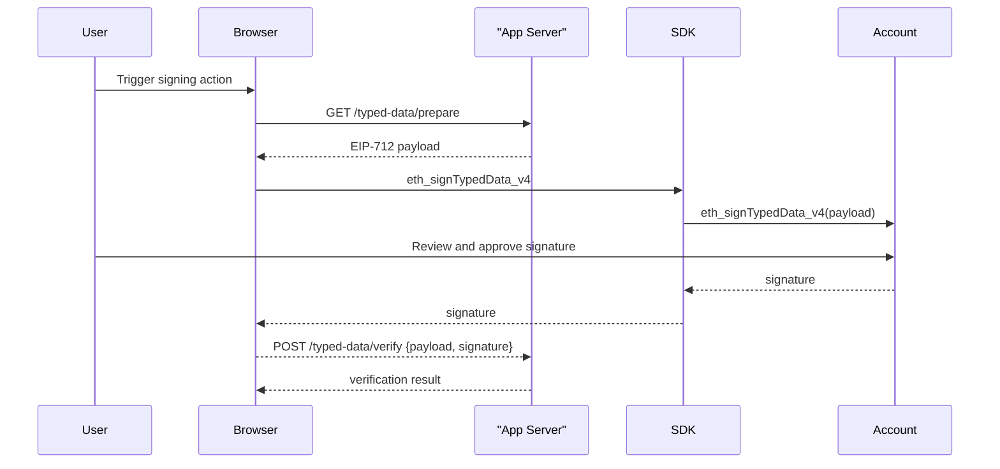

## Overview

EIP-712 structured data signing allows you to create human-readable, type-safe messages that users can sign with their wallet. Unlike personal signatures, typed data signatures are structured and domain-bound, making them ideal for secure application-specific use cases like permissions, attestations, and proofs.

Base Accounts fully support EIP-712 signing through the standard `eth_signTypedData_v4` method, with automatic ERC-6492 wrapping for undeployed smart wallets.

## High-level flow



## Implementation

### Code Snippets

<CodeGroup>
```ts Browser (SDK)
import { createBaseAccountSDK } from "@base-org/account";

// Initialize the SDK
const provider = createBaseAccountSDK().getProvider();

// 1 — Prepare the typed data payload
const typedData = {
  domain: {
    name: 'My App',
    version: '1',
    chainId: 8453, // Base mainnet
    verifyingContract: '0x...' // Your contract address
  },
  types: {
    Permission: [
      { name: 'user', type: 'address' },
      { name: 'action', type: 'string' },
      { name: 'resource', type: 'string' },
      { name: 'expiry', type: 'uint256' },
      { name: 'nonce', type: 'uint256' }
    ]
  },
  primaryType: 'Permission',
  message: {
    user: '0x...',
    action: 'read',
    resource: 'profile',
    expiry: Math.floor(Date.now() / 1000) + 3600, // 1 hour from now
    nonce: 123456
  }
};

// 2 — Request signature from user
try {
  const accounts = await provider.request({
    method: 'eth_requestAccounts'
  });
  
  const signature = await provider.request({
    method: 'eth_signTypedData_v4',
    params: [accounts[0], JSON.stringify(typedData)]
  });

  // 3 — Send to backend for verification
  const response = await fetch('/typed-data/verify', {
    method: 'POST',
    headers: { 'Content-Type': 'application/json' },
    body: JSON.stringify({ 
      typedData, 
      signature, 
      address: accounts[0] 
    })
  });
  
  const result = await response.json();
  console.log('Verification result:', result);
} catch (err) {
  console.error('Signing failed:', err);
}
```

```ts Backend (Viem)
import { createPublicClient, http } from 'viem';
import { base } from 'viem/chains';

const client = createPublicClient({ 
  chain: base, 
  transport: http() 
});

export async function verifyTypedData(req, res) {
  const { typedData, signature, address } = req.body;
  
  try {
    // Verify the typed data signature
    const valid = await client.verifyTypedData({
      address,
      domain: typedData.domain,
      types: typedData.types,
      primaryType: typedData.primaryType,
      message: typedData.message,
      signature
    });

    if (!valid) {
      return res.status(401).json({ error: 'Invalid signature' });
    }

    // Additional validation logic here
    // e.g., check expiry, nonce, permissions, etc.
    const now = Math.floor(Date.now() / 1000);
    if (typedData.message.expiry < now) {
      return res.status(401).json({ error: 'Signature expired' });
    }

    // Process the verified typed data
    res.json({ 
      valid: true, 
      message: 'Signature verified successfully',
      data: typedData.message 
    });
  } catch (error) {
    console.error('Verification error:', error);
    res.status(500).json({ error: 'Verification failed' });
  }
}
```
</CodeGroup>

## Common Use Cases

### 1. Permissions and Authorizations

```tsx
const permissionTypedData = {
  domain: {
    name: 'MyDApp',
    version: '1',
    chainId: 8453,
    verifyingContract: '0x...'
  },
  types: {
    Permission: [
      { name: 'user', type: 'address' },
      { name: 'action', type: 'string' },
      { name: 'resource', type: 'string' },
      { name: 'expiry', type: 'uint256' }
    ]
  },
  primaryType: 'Permission',
  message: {
    user: userAddress,
    action: 'transfer',
    resource: 'tokens',
    expiry: Math.floor(Date.now() / 1000) + 86400 // 24 hours
  }
};
```

### 2. Attestations and Proofs

```tsx
const attestationTypedData = {
  domain: {
    name: 'Identity Verifier',
    version: '1',
    chainId: 8453,
    verifyingContract: '0x...'
  },
  types: {
    Attestation: [
      { name: 'subject', type: 'address' },
      { name: 'claim', type: 'string' },
      { name: 'value', type: 'string' },
      { name: 'timestamp', type: 'uint256' }
    ]
  },
  primaryType: 'Attestation',
  message: {
    subject: userAddress,
    claim: 'email_verified',
    value: 'true',
    timestamp: Math.floor(Date.now() / 1000)
  }
};
```

### 3. Orders and Transactions

```tsx
const orderTypedData = {
  domain: {
    name: 'Marketplace',
    version: '1',
    chainId: 8453,
    verifyingContract: '0x...'
  },
  types: {
    Order: [
      { name: 'maker', type: 'address' },
      { name: 'taker', type: 'address' },
      { name: 'tokenId', type: 'uint256' },
      { name: 'price', type: 'uint256' },
      { name: 'deadline', type: 'uint256' }
    ]
  },
  primaryType: 'Order',
  message: {
    maker: userAddress,
    taker: '0x0000000000000000000000000000000000000000', // Any taker
    tokenId: 123,
    price: '1000000000000000000', // 1 ETH in wei
    deadline: Math.floor(Date.now() / 1000) + 3600
  }
};
```

## Example Express Server

```ts title="server/typed-data.ts"
import express from 'express';
import { createPublicClient, http } from 'viem';
import { base } from 'viem/chains';

const app = express();
app.use(express.json());

const client = createPublicClient({ 
  chain: base, 
  transport: http() 
});

// Simple nonce store (use Redis/DB in production)
const usedNonces = new Set<string>();

app.get('/typed-data/prepare', (req, res) => {
  const { userAddress, action, resource } = req.query;
  
  const nonce = Math.floor(Math.random() * 1000000);
  const expiry = Math.floor(Date.now() / 1000) + 3600; // 1 hour
  
  const typedData = {
    domain: {
      name: 'My App',
      version: '1',
      chainId: 8453,
      verifyingContract: '0x1234567890123456789012345678901234567890'
    },
    types: {
      Permission: [
        { name: 'user', type: 'address' },
        { name: 'action', type: 'string' },
        { name: 'resource', type: 'string' },
        { name: 'expiry', type: 'uint256' },
        { name: 'nonce', type: 'uint256' }
      ]
    },
    primaryType: 'Permission',
    message: {
      user: userAddress,
      action: action || 'read',
      resource: resource || 'profile',
      expiry,
      nonce
    }
  };
  
  res.json(typedData);
});

app.post('/typed-data/verify', async (req, res) => {
  const { typedData, signature, address } = req.body;
  
  try {
    // 1. Check nonce hasn't been reused
    const nonceKey = `${address}-${typedData.message.nonce}`;
    if (usedNonces.has(nonceKey)) {
      return res.status(400).json({ error: 'Nonce already used' });
    }
    
    // 2. Check expiry
    const now = Math.floor(Date.now() / 1000);
    if (typedData.message.expiry < now) {
      return res.status(400).json({ error: 'Signature expired' });
    }
    
    // 3. Verify signature
    const valid = await client.verifyTypedData({
      address,
      domain: typedData.domain,
      types: typedData.types,
      primaryType: typedData.primaryType,
      message: typedData.message,
      signature
    });
    
    if (!valid) {
      return res.status(401).json({ error: 'Invalid signature' });
    }
    
    // 4. Mark nonce as used
    usedNonces.add(nonceKey);
    
    // 5. Process the verified action
    res.json({ 
      valid: true,
      message: 'Typed data verified successfully',
      action: typedData.message.action,
      resource: typedData.message.resource
    });
  } catch (error) {
    console.error('Verification error:', error);
    res.status(500).json({ error: 'Verification failed' });
  }
});

app.listen(3001, () => console.log('Typed data server listening on :3001'));
```

## Best Practices

### Domain Separation
Always use unique domain parameters to prevent signature replay across different applications:

```tsx
const domain = {
  name: 'Your App Name',           // Unique app identifier
  version: '1',                    // Version your types
  chainId: 8453,                   // Network-specific
  verifyingContract: contractAddr   // Contract that will verify
};
```

### Nonce Management
Include nonces to prevent replay attacks:

```tsx
// Generate unique nonces
const nonce = crypto.randomBytes(16).toString('hex');

// Store and validate nonces server-side
const usedNonces = new Set(); // Use Redis/DB in production
```

### Expiry Times
Always include expiry timestamps for time-bound signatures:

```tsx
const expiry = Math.floor(Date.now() / 1000) + 3600; // 1 hour
```

### Error Handling
Provide clear error messages for common failure cases:

```tsx
if (expiry < now) return res.status(400).json({ error: 'Signature expired' });
if (usedNonces.has(nonce)) return res.status(400).json({ error: 'Nonce reused' });
if (!valid) return res.status(401).json({ error: 'Invalid signature' });
```

import PolicyBanner from "/snippets/PolicyBanner.mdx";

<PolicyBanner />